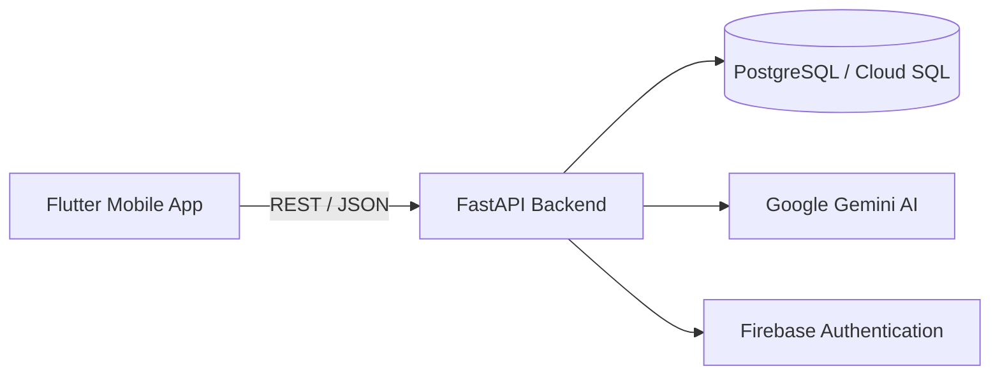

#  Eaty
### Integrated Food, Grocery & AI Ecosystem  "All in One"

**A modern, cloud-native super app that unifies food delivery, grocery shopping, and AI-powered recipe generation.**

<p align="center">
  <a href="https://flutter.dev"></a>
  <a href="https://fastapi.tiangolo.com"></a>
  <a href="https://www.postgresql.org"></a>
  <a href="https://cloud.google.com/run"></a>
  <a href="https://deepmind.google/technologies/gemini/"></a>
</p>

</div>

---

## ✨ Why Eaty?

Most users rely on **multiple apps** for food delivery, grocery shopping, and recipes.  
Eaty brings all of these experiences together into **one intelligent ecosystem**.

With **AI-powered cooking assistance**, a **unified marketplace**, and a **business management panel**, Eaty is designed to simplify daily food decisions for consumers while empowering food businesses with modern digital tools.

---

## 🧠 Key Highlights

- 🍽 **Unified Food & Grocery Marketplace**
- 🤖 **AI Recipe Assistant (Text & Image Based)**
- 🏪 **Business Dashboard for Restaurants & Markets**
- ☁️ **Cloud-Native & Scalable Architecture**
- 🔐 **Secure Authentication with Firebase**

---

## 🚀 Features

### Consumer Experience (B2C)
- Browse restaurants and markets from a single interface  
- Generate recipes by entering ingredients or uploading a photo  
- Smart cart and smooth checkout flow  
- Live order status tracking  

### Business Experience (B2B)
- Accept or reject orders in real-time  
- Manage menus, categories, and product images  
- Track daily revenue and order analytics  
- One-tap open / close store status  

---

## 🏗 Architecture Overview



### Design Principles
- Stateless backend services  
- Horizontal scalability via Cloud Run  
- Modular and maintainable architecture  

---

## 🛠 Tech Stack

| Layer | Technology |
|-----|-----------|
| Mobile | Flutter |
| Backend | FastAPI (Python) |
| Database | PostgreSQL |
| Cloud | Google Cloud Run |
| AI | Google Gemini Pro |
| Auth | Firebase Authentication |

---

## 📱 website
https://yusuftsnck.github.io/website/ 

---

## ⚡ Getting Started

### Requirements
- Flutter 3.x+
- Python 3.10+
- Google Cloud Project (Cloud SQL + Gemini API enabled)

### Installation

```bash
git clone https://github.com/yusuftsnck/Eaty.git
cd Eaty
```

#### Backend
```bash
cd api
python -m venv venv
source venv/bin/activate
pip install -r requirements.txt
uvicorn main:app --reload
```

#### Mobile
```bash
flutter pub get
flutter run
```


---

## 🛣 Roadmap

- [ ] Multi-language support (EN / AR)
- [ ] Health-aware AI (diet & allergies)
- [ ] Real-time courier tracking
- [ ] Promotions & campaigns for businesses

---

## 👨‍💻 Author

**Yusuf Şaban Tosuncuk**  
Software Engineering Student  

🔗 GitHub: https://github.com/yusuftsnck  

---


