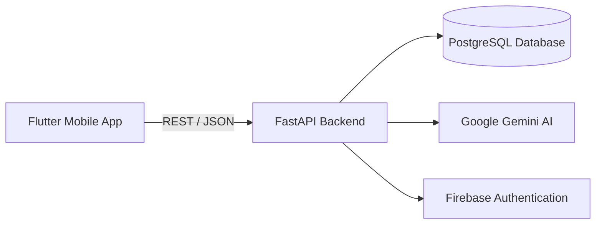

# 🍊 Eaty  
## Integrated Food, Grocery & AI Ecosystem  

---

## Abstract

**Eaty** is a cloud-native, cross-platform mobile application designed to address the fragmented nature of modern food-related digital services.  
The system integrates **ready-to-eat food delivery**, **grocery shopping**, and **AI-powered recipe generation** into a single unified ecosystem.

By leveraging **Flutter** for mobile development, **FastAPI** for backend services, **PostgreSQL** for persistent storage, and **Google Gemini AI** for intelligent recipe generation, Eaty provides both **consumer-facing (B2C)** and **business-facing (B2B)** modules within one scalable architecture.

---

## 1. Introduction

Daily food management typically requires users to interact with multiple applications for ordering meals, purchasing groceries, and searching for recipes.  
This fragmented experience leads to inefficiency, decision fatigue, and poor user satisfaction.

Eaty aims to solve this problem by offering a **Super App** approach, combining all food-related workflows into a single mobile application while also providing a professional management interface for restaurants and markets.

---

## 2. Problem Definition

The primary challenges addressed by Eaty include:

- Fragmented digital food ecosystems  
- High cognitive load when deciding meals  
- Lack of intelligent recipe suggestions  
- Complex and costly digitization processes for small food businesses  

---

## 3. Proposed Solution

Eaty introduces an integrated platform with the following characteristics:

- A **unified marketplace** for food and grocery ordering  
- An **AI-powered kitchen assistant** that analyzes ingredients via text or images  
- A **B2B business dashboard** for order and menu management  
- A **cloud-native backend** ensuring scalability and reliability  

---

## 4. System Overview

The system consists of four major components:

1. **Mobile Client (Flutter)**  
2. **Backend API (FastAPI on Google Cloud Run)**  
3. **Relational Database (PostgreSQL on Cloud SQL)**  
4. **AI Services (Google Gemini API)**  

---

## 5. Functional Requirements

### 5.1 Consumer Module (B2C)

- User registration and authentication  
- Restaurant and market browsing  
- AI-based recipe generation  
- Shopping cart and checkout  
- Order tracking  

### 5.2 Business Module (B2B)

- Business authentication  
- Menu and product management  
- Order lifecycle management  
- Revenue and analytics dashboard  

---

## 6. Non-Functional Requirements

- Scalability through stateless services  
- Secure authentication and authorization  
- High availability and fault tolerance  
- Maintainable and modular architecture  

---

## 7. System Architecture

---

## 8. Technology Stack

| Layer | Technology |
|------|-----------|
| Mobile | Flutter |
| Backend | FastAPI (Python) |
| Database | PostgreSQL |
| Cloud | Google Cloud Run |
| AI | Google Gemini Pro |
| Auth | Firebase Authentication |

---

## 9. Implementation Details

- Backend services are containerized using Docker  
- Cloud Run enables automatic scaling  
- Secure database connections are established via Cloud SQL  
- AI requests are processed through Gemini API endpoints  

---

## 10. Evaluation & Discussion

The proposed system demonstrates that a unified architecture can significantly reduce user friction in daily food management while also simplifying digital operations for businesses.

The modular design ensures future extensibility and easy maintenance.

---

## 11. Future Work

- Multi-language support  
- Health-aware recipe filtering  
- Real-time courier tracking  
- Promotion and campaign management  

---

## 12. Conclusion

Eaty successfully demonstrates the feasibility of integrating food delivery, grocery shopping, and AI-assisted cooking within a single mobile application.  
The project meets both functional and non-functional requirements defined for the SE 3505 course and provides a strong foundation for future expansion.

---

## Author

**Yusuf Şaban Tosuncuk**  
GitHub: https://github.com/yusuftsnck/Eaty
website: https://yusuftsnck.github.io/website/

---

